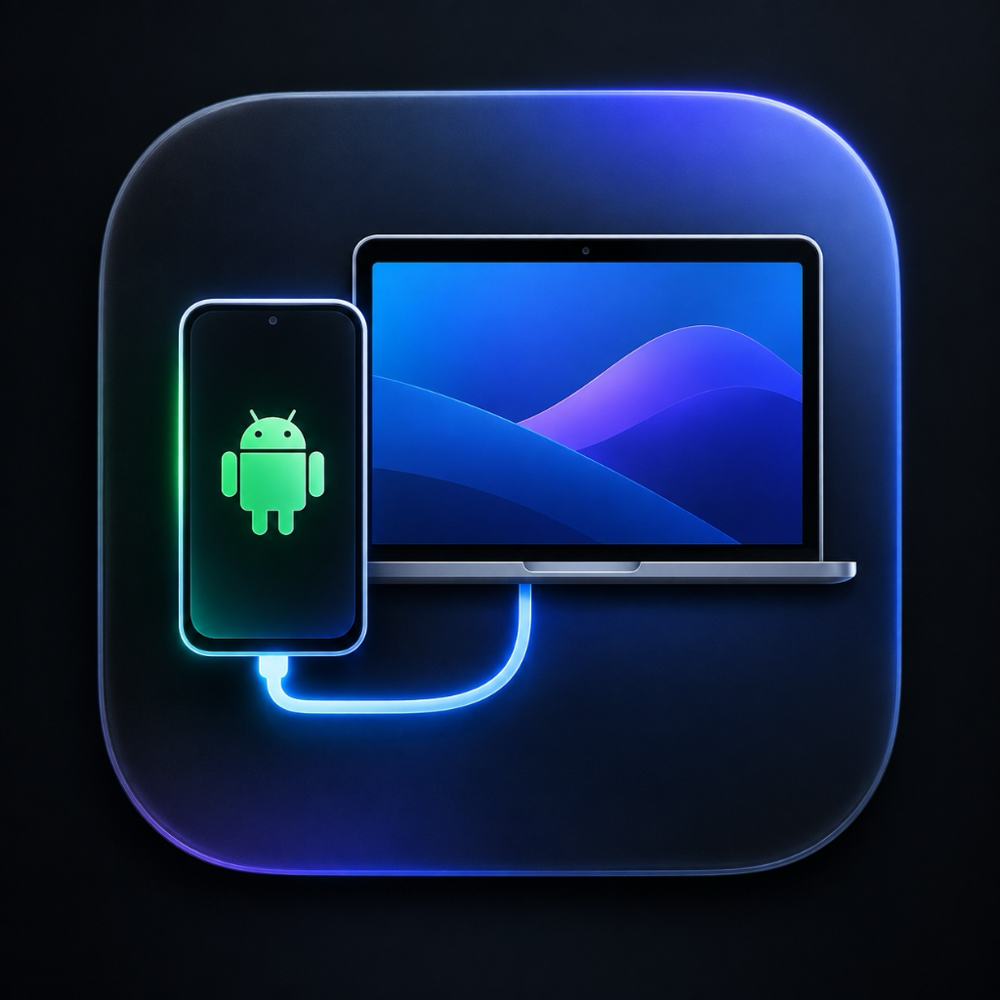

<p align="center">
  
</p>

<h1 align="center">ScrcpyGUI for macOS</h1>

<p align="center">
  <b>A sleek, fast, and native macOS frontend for <a href="https://github.com/Genymobile/scrcpy">scrcpy</a> built with SwiftUI.</b>
</p>

<p align="center">
  Effortlessly mirror, control, and record your Android phone with ultra-low latency, crystal-clear audio, dynamic hardware-matched sliders, and a dedicated Screen Recording Studio.
</p>

---

## ✨ Features

### 1. 📱 Screen Mirroring Mode
- **Hardware-Aware Adaptive Sliders**: Automatically detects your connected Android phone's native resolution, peak refresh rate (e.g. 90Hz / 120Hz), and Android version via ADB.
- **Display Quality Controls**: Fast quick-chip presets and fine-tuning sliders for Max Resolution (`Native`, `1440p`, `1080p`, `720p`), Max Frame Rate (`30`, `60`, `90`, `120 FPS`), and Bitrate (`4M` to `32M`).
- **Sound & Audio Forwarding**: Real-time audio streaming to your Mac with configurable audio buffer delay for stutter-free wireless mirroring.
- **Device & Window Controls**: Turn screen off while mirroring, prevent phone from sleeping, show touch feedback dots, view-only mode, borderless window, and always-on-top.

### 2. 🎥 Dedicated Screen Recording Studio
- **Dual Display Option**:
  - **Windowed Mode**: Displays the live phone mirror window on Mac so you can view and control the device while recording.
  - **Background Mode (Headless)**: Suppresses the mirror window entirely—saves video directly to disk with zero screen clutter.
- **Live Sound on Mac**: Enjoy live game sound through your Mac speakers while recording in the background!
- **Dual Audio Output (`--audio-dup`)**: Play sound simultaneously on both phone speakers and Mac speakers (Android 10+).
- **1-Click Quality Presets**: `Original Native`, `1080p FHD`, `720p HD`, and `Custom`.
- **Advanced Codec Selection**: Choose between `H.264`, `H.265 / HEVC` (50% smaller file size), and `AV1`.
- **Live Recording Metrics**: Real-time pulsing recording indicator, live elapsed timer, and live file size counter.

### 3. 📶 1-Click Wireless Setup Tool
- Switch any USB-connected Android phone to Wi-Fi mode with a single tap.
- Automatically enables TCP/IP mode (`5555`), discovers the device's local IP address, connects over Wi-Fi, and lets you unplug the USB cable.

### 4. ⚡ Fast & Un-congested UI
- Clean, categorized tabs for quick configuration without vertical scrolling walls.
- Live scrcpy terminal console with copy & clear buttons.
- 1-click **Copy Command Bar** to inspect the exact `scrcpy` CLI command being run.
- Global keyboard shortcut: **⌘R** to Start / Stop mirroring or recording.

---

## 🚀 Installation

### Prerequisites
`ScrcpyGUI` requires `scrcpy` and `adb` to be installed on your Mac. If you don't already have them, install via [Homebrew](https://brew.sh):

```bash
brew install scrcpy
```

### Install ScrcpyGUI

1. Download the latest **`ScrcpyGUI.dmg`** from the [GitHub Releases](https://github.com/Ritik-rao8/Scrcpy_GUI/releases) page.
2. Double-click `ScrcpyGUI.dmg`.
3. Drag **`ScrcpyGUI.app`** into your **Applications** folder.
4. **First-Time Launch Note**:
   - Because the app is not signed with an Apple Developer ID, macOS Gatekeeper may show a warning on first launch.
   - Simply **Right-click (or Control-click)** `ScrcpyGUI.app` in your Applications folder and select **Open**, then click **Open**.

---

## 🛠️ Building from Source

### Prerequisites
- macOS 13.0 (Ventura) or later
- Xcode 15+ or Swift 5.9+ Command Line Tools

### Run Locally
```bash
git clone https://github.com/Ritik-rao8/Scrcpy_GUI.git
cd Scrcpy_GUI
swift run ScrcpyGUI
```

### Build `.dmg` Package
To compile a production build and create a standalone `.dmg` installer:

```bash
./create_dmg.sh
```
This will generate `ScrcpyGUI.dmg` in the project root.

---

## 📄 License

This project is licensed under the **MIT License** — see the [LICENSE](LICENSE) file for details.

## 🤝 Contributing & Feedback

Contributions, feature requests, and bug reports are welcome! Feel free to open an issue or submit a pull request.
